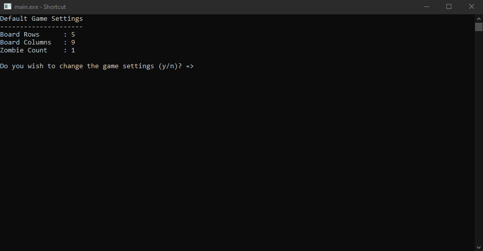

# Alien vs. Zombie



This is the link of the demo (https://youtu.be/N-zW7AZEOGs).

## Compilation Instructions


```
g++ main.cpp folder1\code.cpp folder2\code.cpp ......
```

## User Manual
User can choose whether to customise the game before enter the game.

Type in the following commands to play the game:

1. up           - Move Up
2. down         - Move Down
3. left         - Move Left
4. right        - Move Right
5. arrow        - Change the direction of an arrow using row and column
6. help         - Display the user commands
7. save         - Save the game
8. load         - Load previous saved game
9. quit         - Exit the game


## Progress Log

- [Part 1](PART1.md)
- [Part 2](PART2.md)

## Contributors


- Wesley Wong Min Guan
- Tang Yu Xuan
- Koh Jia Jie


