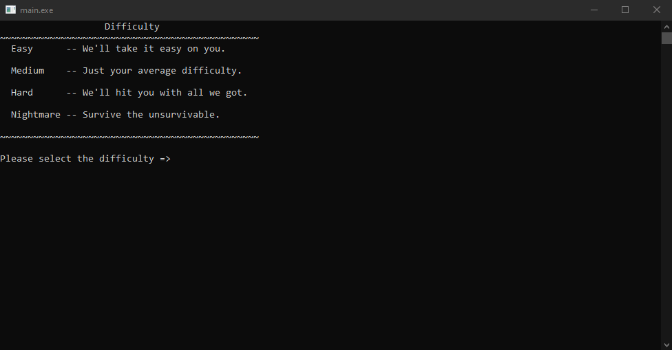

# Alien vs. Zombie



This is the link of the demo (https://youtube.com/playlist?list=PLHnyQ9de_gVoJPu0rF4l9zZJpZMrdI7YJ).

## Compilation Instructions


```
g++ main.cpp folder1\code.cpp folder2\code.cpp ......
```

## User Manual
User can choose whether to customise the game difficulty and gameboard before enter the game.

Types of objects that will display on the gameboard:

 1. '^' 'v' '<' '>' - Arrow             - Allow alien to change its direction while moving
 2. 'h'             - Health Pack       - Increase alien's health by 20
 3. 'p'             - Pod               - Deal 10 dammage to the nearest zombie
 4. 'r'             - Rock              - Stop alien's move and reveal an hidden object beneath it
 5. '@'             - Teleport Portal   - Teleport alien to another portal
 6. '~'             - 
 6. ' '             - Space             - Nothing
 7. '.'             - Trail             - Nothing but show alien's trail
 8. 'A'             - Alien             - Alien itself
 9. '1'-'9'         - Zombie            - Zombies
10. 'B'             - Zombie Boss       - Only appear after all zombies are dead

Type in the following commands to play the game:

 1. up      - Move Up
 2. down    - Move Down
 3. left    - Move Left
 4. right   - Move Right
 5. arrow   - Change the direction of an arrow using row and column
 6. help    - Display the command list
 7. object  - Display the object list
 8. save    - Save the game
 9. load    - Load previous saved game
10. quit    - Exit the game


## Progress Log

- [Part 1](PART1.md)
- [Part 2](PART2.md)

## Contributors


- Wesley Wong Min Guan
- Tang Yu Xuan
- Koh Jia Jie


